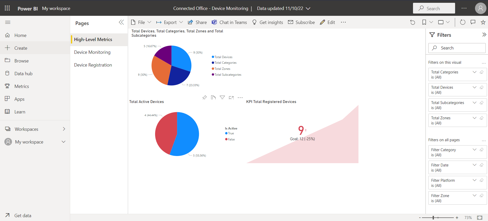
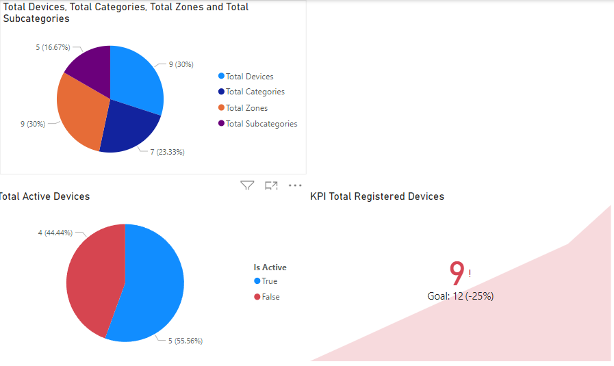
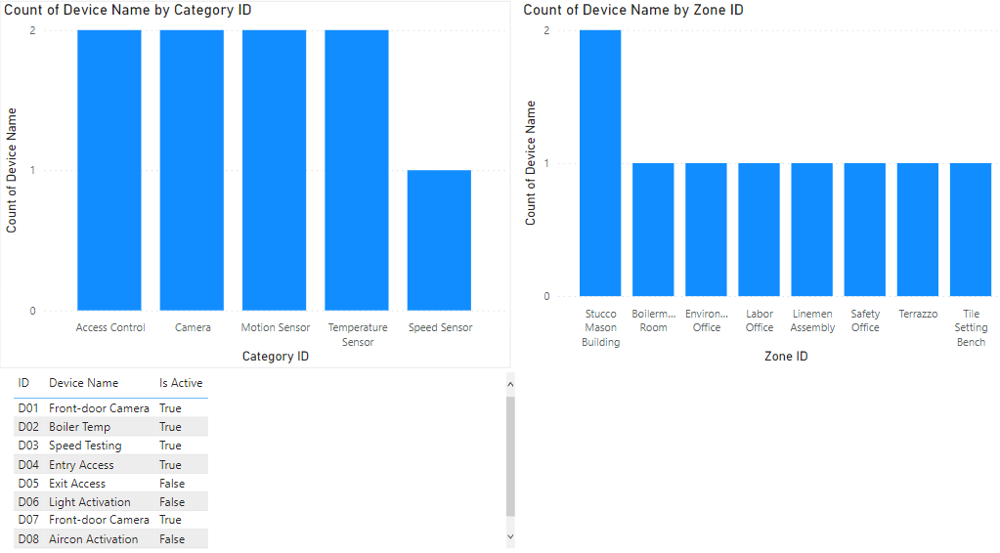
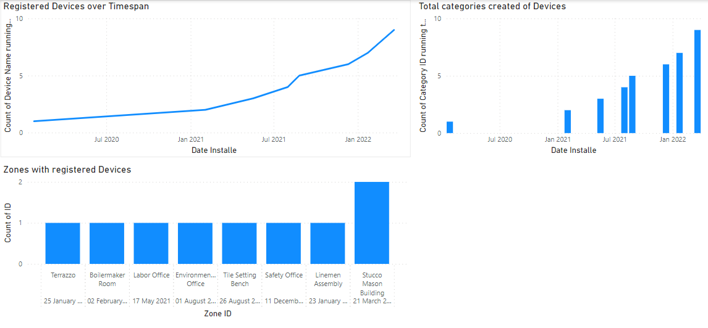

# CMPG323-Project-5---35359099
## Data Sources
This project is connected to 2 data sources. It is connected to the "Live" Sharepoint Excel File and It is also connected to an offline static version of the same data source downloaded from the Sharepoint URL provided in the Project 5 pdf. The 2 data sources are merged within the query editor in Power BI. This project has not been connected to the API in project 2.

## Hosting
This project has been hosted online on the Power BI Service. Both the dataset and report has added to the online workspace.

## Overview
### High Level Metrics

### Device Monitoring

### Device Registration

## Reference List
- Langmann, K., n.d. Power BI Best Practices: 10 Guidelines to Always Follow. [Online] 
Available at: https://spreadsheeto.com/power-bi-best-practices/
[Accessed 04 11 2022].

- Monaraya, 2020. Quick steps for connecting to SharePoint using Power BI Desktop. [Online] 
Available at: https://community.powerbi.com/t5/Community-Blog/Quick-steps-for-connecting-to-SharePoint-using-Power-BI-Desktop/ba-p/1551595
[Accessed 6 11 2022].

- MS Learn, 2022. Create key performance indicator (KPI) visualizations. [Online] 
Available at: https://learn.microsoft.com/en-us/power-bi/visuals/power-bi-visualization-kpi?tabs=powerbi-desktop
[Accessed 9 11 2022].

- MS Learn, 2022. Introduction to Power BI. [Online] 
Available at: https://learn.microsoft.com/en-us/training/modules/introduction-power-bi/
[Accessed 04 11 2022].

- MS Learn, 2022. Publish datasets and reports from Power BI Desktop. [Online] 
Available at: https://learn.microsoft.com/en-us/power-bi/create-reports/desktop-upload-desktop-files
[Accessed 10 11 2022].

